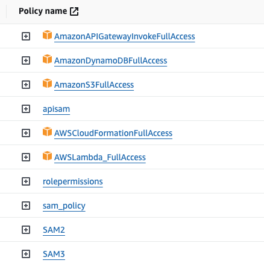
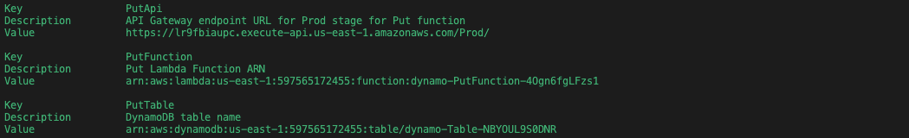
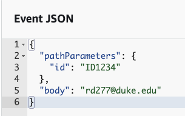
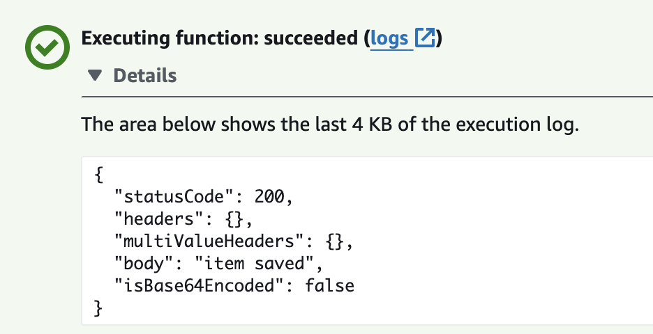
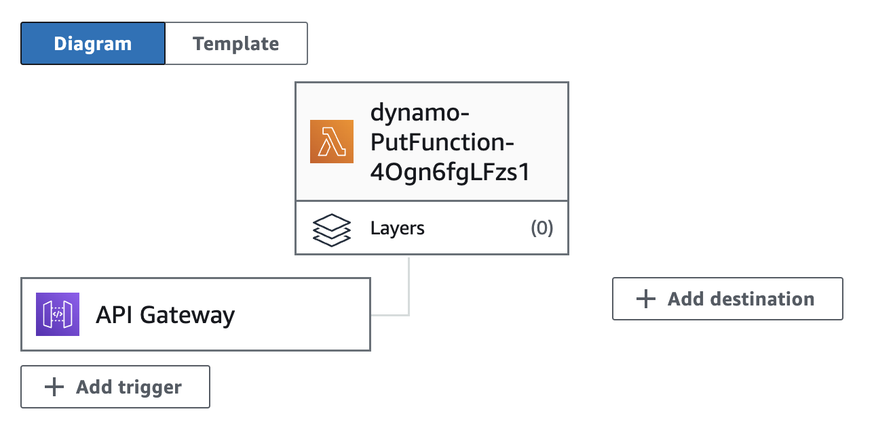

# Lambda microservice in AWS

# AWS Serverless Application with Rust Lambda and DynamoDB Integration

## Overview

This repository contains the source code and configuration files for a serverless application built on AWS using the Serverless Application Model (SAM). The application consists of a Lambda function written in Rust, which interacts with a DynamoDB database to update data based on incoming payloads.

## Prerequisites

Before deploying and running this serverless application, ensure that you have the following prerequisites set up:

- AWS account
- AWS CLI installed and configured
- SAM CLI installed

- Rust programming language installed (for building the Lambda function locally)

## Getting Started

To deploy and run the serverless application (SAM), follow these steps:

1. **Create a virtual environment:**
```bash
python -m venv venv
source venv/bin/activate
```

Sometimes you need to deactivate conda

```bash
conda deactivate
```

2. **install the necessary dependencies:**


```bash
curl "https://awscli.amazonaws.com/AWSCLIV2.pkg" -o "AWSCLIV2.pkg"
sudo installer -pkg AWSCLIV2.pkg -target /
aws configure
```
Here you need to add the necessary IAM permissions:



```bash
pip install aws-sam-cli
```

Install cargo if you don't have it:

```bash
curl --proto '=https' --tlsv1.2 -sSf https://sh.rustup.rs | sh
```

3. **Deploy the Application:**
   ```bash
   sam deploy --guided
   ```
   Follow the prompts to configure your deployment. SAM will package and deploy your application stack to AWS.

   

4. **Test the Application:**
   Once the deployment is complete, you can test the application by invoking the Lambda function or sending payloads to trigger updates in the DynamoDB table.

    

## Configuration

- **Lambda Function**: The Rust code for the Lambda function resides in the `lambda_function` directory. Update the code logic in `src/main.rs` according to your requirements.



- **DynamoDB Table**: The application interacts with a DynamoDB table to update data. Ensure that you have the necessary permissions and configuration set up in AWS.

## Folder Structure

- **`lambda_function`**: Contains the source code for the Rust Lambda function.
- **`template.yaml`**: SAM template file defining the AWS resources for the serverless application.


## License

This project is licensed under the MIT License - see the [LICENSE](LICENSE) file for details.

## Acknowledgments

- Thanks to the AWS team for providing the Serverless Application Model (SAM) framework.
- Inspiration and guidance from various serverless application examples and tutorials.
  
Feel free to reach out to me if you have any questions or need further assistance!